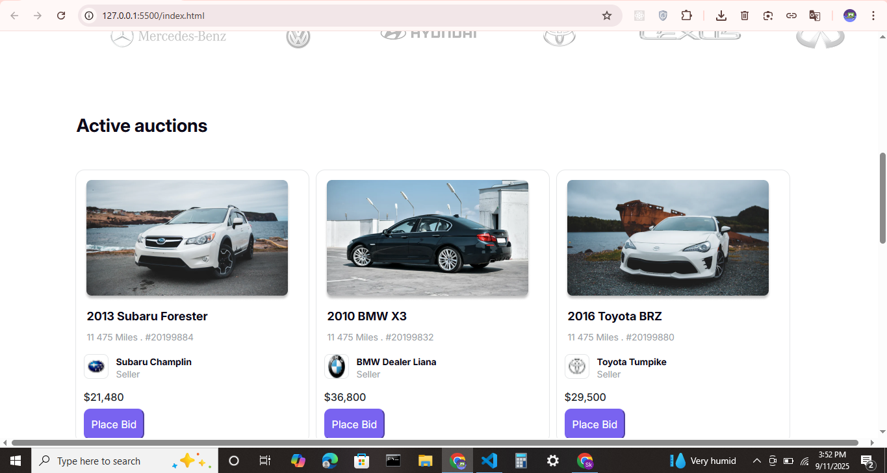
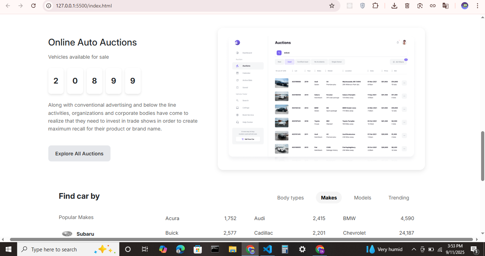

# Figma to HTML Project  

This project is a **Figma design to responsive website** conversion built with **HTML, CSS, Bootstrap, and JavaScript**.  
The goal of this project is to practice converting UI/UX designs into real, functional web pages.  

---

## 🚀 Features  
- Pixel-perfect design conversion from Figma  
- Responsive layout using **Bootstrap Css**  
- Clean and reusable **HTML & CSS** structure  

---
🌐 Live Demo: 
---
---
📸 Preview
1. 
2. 
3. 
---

## 🛠️ Technologies Used  
- **HTML5**  
- **CSS3**  
- **Bootstrap 5**  
- **JavaScript (ES6)**  

---


## 🔧 How to Run the Project  
1. Clone the repository:  
   ```bash
   git clone https://github.com/your-username/your-repo-name.git
2. Open index.html file in your browser.

🤝 Contributing

If you’d like to improve this project, feel free to fork the repo and submit a pull request.

## 📝 License
- [MIT License](LICENSE)

