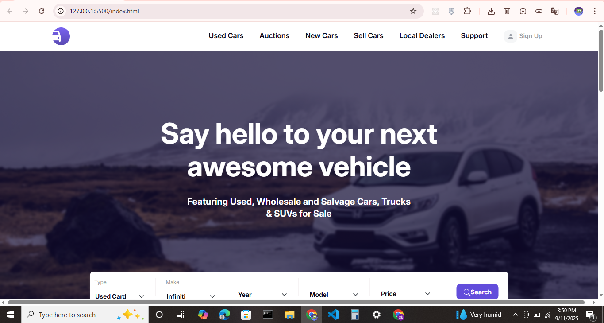

# Figma to HTML Project  

This project is a **Figma design to responsive website** conversion built with **HTML, CSS, Bootstrap, and JavaScript**.  
The goal of this project is to practice converting UI/UX designs into real, functional web pages.  
# 🚗 Car Seller Website  

This project is a **Car Seller Website** converted from a Figma design into a responsive web application using **HTML, CSS, Bootstrap, and JavaScript**.  
The website showcases cars for sale with modern UI design and smooth interactions.  


---

## 🚀 Features  
- Responsive design for desktop, tablet, and mobile  
- Car listing with images and details  
- Navigation bar and footer  
- Interactive buttons and animations with JavaScript  
- Built with Bootstrap 5

---
### 🌐 Live Demo: [Click here](https://carsellerweb.netlify.app/)
### Or, Link: https://carsellerweb.netlify.app
 

---

📸 Preview
1. 
2. 
3. 
---

## 🛠️ Technologies Used  
- **HTML5**  
- **CSS3**  
- **Bootstrap 5**  
- **JavaScript (ES6)**  

---


## 🔧 How to Run the Project  
1. Clone the repository:  
   ```bash
   git clone https://github.com/your-username/your-repo-name.git
2. Open index.html file in your browser.

🤝 Contributing

If you’d like to improve this project, feel free to fork the repo and submit a pull request.

## 📝 License
- [MIT License](LICENSE)

